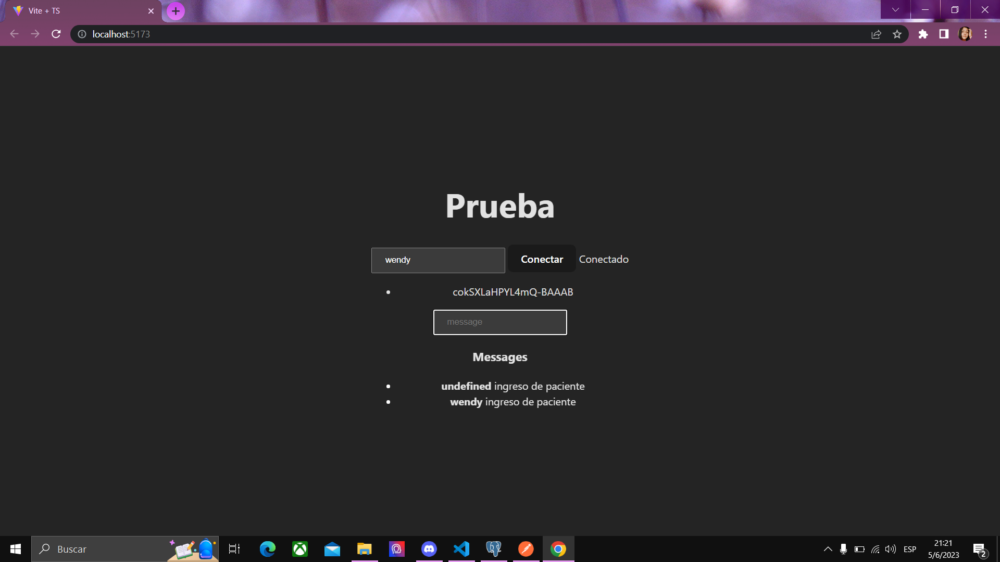

# Taller 2 de 2p

  
Evidencia del taller n2

## WEB SOCKET

CREACION DEL RECURSO PACIENTE

CREACION DEL REST API

INSERTANDO PACIENTE EN POSTMAN

EVIDENCIA DE LA CREACION DE LA ENTIDAD PACIENTE EN POSTGRES SQL 

EVIDENCIA DE PRUEBA DE CONEXION Y GENERACION DE TOKEN 

EVIDENCIA DEL MENSAJE 
