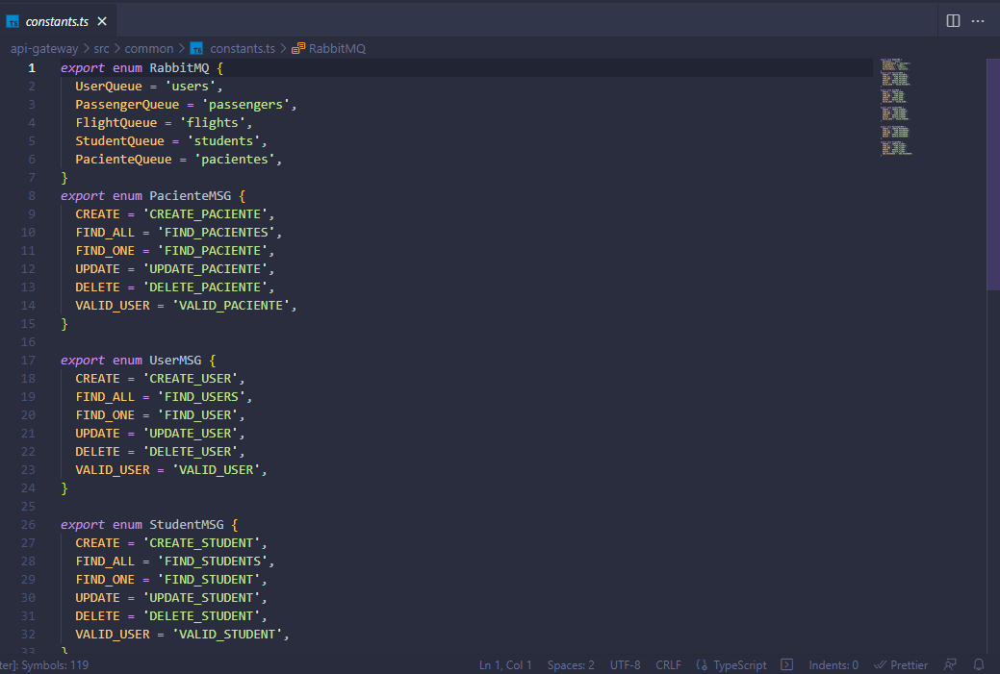

# PRÁCTICA 4

 

## REALIZANDO GUARDADO DE DATO DESDE POSTMAN CON LA ENTIDAD PACIENTE

## REALIZANDO CONSULTA DE DATO DESDE POSTMAN CON LA ENTIDAD PACIENTE A TRAVES DE GET

## EVIDENCIA DESDE MONGO ATLAS 

## EVIDENCIA DE LAS COLAS EN CLOUDAMQP

## EVIDENCIA DE GRAFICA AL RECIBIR DATOS EN COLA

## EVIDENCIA DE CODIGO FUENTE CUANDO SE CREA LA COLA 

